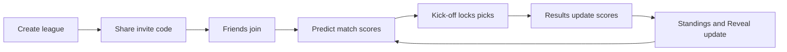

# ⚽ Tournament Predictor

Predict football match scores with friends. No accounts needed — create a league, share a code, compete.

Built with Next.js 14, Supabase, Tailwind CSS, and Groq AI.

## How to play

1. Create a league and share the invite code with friends.
2. Predict each match score before kick-off.
3. Match predictions lock when the match starts.
4. Score points for exact scores or correct outcomes.
5. Use **My Picks** to choose the tournament winner and Golden Boot winner.
6. Check **Standings** after results are entered or synced.
7. Use **Reveal** to see anonymous trends before kick-off and named picks after matches lock.

If players have the same total points, the player with more exact-score predictions ranks higher.



## Quick start

```bash
# 1. Install
npm install

# 2. Copy env template and fill in your keys (see below)
cp .env.example .env.local

# 3. Run the database schema
#    → Open supabase/schema.sql in your Supabase SQL editor and Run

# 4. Start
npm run dev
```

## Environment variables

| Variable | How to get it |
|---|---|
| `NEXT_PUBLIC_SUPABASE_URL` | Supabase → Project Settings → API |
| `NEXT_PUBLIC_SUPABASE_ANON_KEY` | Supabase → Project Settings → API |
| `SUPABASE_SERVICE_ROLE_KEY` | Supabase → Project Settings → API |
| `FOOTBALL_DATA_API_KEY` | [football-data.org/client/register](https://www.football-data.org/client/register) — free |
| `GROQ_API_KEY` | [console.groq.com](https://console.groq.com) — free |
| `SYNC_SECRET` | Long random value shared between Vercel and the Supabase scheduled sync |

For production auto-sync on Vercel Hobby, use Supabase scheduling instead of Vercel Cron. See [`docs/SUPABASE_VERCEL_SYNC_SETUP.md`](docs/SUPABASE_VERCEL_SYNC_SETUP.md).

## Game rules

### Match predictions

- Exact score: 3 points
- Correct outcome (win/draw/loss): 1 point
- Wrong outcome: 0 points

In `multiplied` mode, knockout matches apply stage multipliers:

- Group: x1
- Round of 16: x2
- Quarter-final: x3
- Semi-final: x4
- Third place: x4
- Final: x5

### Tournament picks

Players can submit/update two tournament picks until their lock deadlines:

- Winner team (locks at final kick-off)
- Golden Boot / top scorer (locks at semi-final kick-off)

Tournament picks are visible to all league members.

Earlier correct picks are worth more points.

Winner pick points by submission window:

- Before first tournament kick-off: 15 points
- Before Round of 16 starts: 12 points
- Before Quarter-finals start: 9 points
- Before Semi-finals start: 6 points
- Before Final starts: 3 points

Top scorer pick points by submission window:

- Before first tournament kick-off: 10 points
- Before Round of 16 starts: 8 points
- Before Quarter-finals start: 6 points
- Before Semi-finals start: 4 points

If a pick is updated later, the latest submission timestamp is used for that pick's bonus tier.

### Prediction visibility rules

- Open matches: everyone sees anonymous aggregate sentiment only (most-picked scores + outcome split).
- Locked/finished matches: named per-player score picks are revealed to the league.
- Finished matches: revealed picks also show points earned for that match.

## Project layout

```
app/
  page.tsx                    Landing page
  join/[code]/page.tsx        Join via shared link
  league/[code]/page.tsx      League hub (server component)
  api/
    leagues/                  Create league
    players/                  Join / session recovery
    predictions/              Save match prediction
    tournament-predictions/   Save tournament picks
    results/                  Admin manual results
    sync/                     Auto-sync from football-data.org
    ai/                       Generate AI insights via Groq

components/
  layout/LeagueHub.tsx        Main game UI (tabs, realtime)
  leaderboard/Leaderboard.tsx Ranked scores with form %
  matches/MatchCard.tsx       Score inputs + AI insight
  matches/MatchList.tsx       Grouped by stage
  predictions/                Tournament picks + admin results
  ui/                         Avatar, InviteCode, StatusPill

lib/
  scoring.ts                  Round-multiplier points engine
  groq.ts                     Groq AI client + prompts
  supabase/                   Client and server Supabase clients
  utils.ts                    Helpers + localStorage session map

supabase/
  schema.sql                  Full DB schema (run once)
  functions/sync-matches/     Edge Function for cron scheduling
```

## App workflow

### Creating and joining
1. Open the home page and create a league — you become the admin and get a 6-character invite code.
2. Share the code or invite link with friends.
3. Friends open the join page, enter the code and a display name, and land directly in the league.
4. No accounts or passwords needed — identity is a session token stored in your browser.

### Making predictions
1. Go to the **Matches** tab before kick-off and enter a predicted score for each open match.
2. Predictions save automatically on blur and can be changed any number of times while the match is open.
3. All picks lock the moment a match kicks off — no edits after that.
4. Go to **My Picks** to set your tournament winner and Golden Boot pick. These stay editable until their respective deadlines (semi-final start for top scorer, final start for winner).

### Seeing others' picks
- While a match is **open**: the **Prediction Reveal** panel inside each match card (and the **Reveal** tab) shows anonymous aggregate sentiment — how many players picked each outcome and the most popular scores, but no names.
- Once a match **locks**: named picks are revealed so you can see exactly who predicted what.
- Once a match **finishes**: points earned per player appear next to their pick.
- **Tournament picks** (winner + top scorer) are always visible to everyone in the league.

### Scoring and standings
1. Points appear on the **Standings** tab in real time as results come in.
2. Exact score = 3 pts; correct outcome = 1 pt; wrong = 0. Knockout stages multiply the base points.
3. Tournament picks score a time-weighted bonus — earlier correct picks earn more.
4. An AI-generated matchday recap appears at the top of Standings after each matchday completes, and a per-match roast recap appears on finished match cards.

## Docs

Full architecture, data model, feature spec, and API setup guides live in `docs/`.
For the production daily + match-window sync setup on Vercel Hobby, see [`docs/SUPABASE_VERCEL_SYNC_SETUP.md`](docs/SUPABASE_VERCEL_SYNC_SETUP.md).
