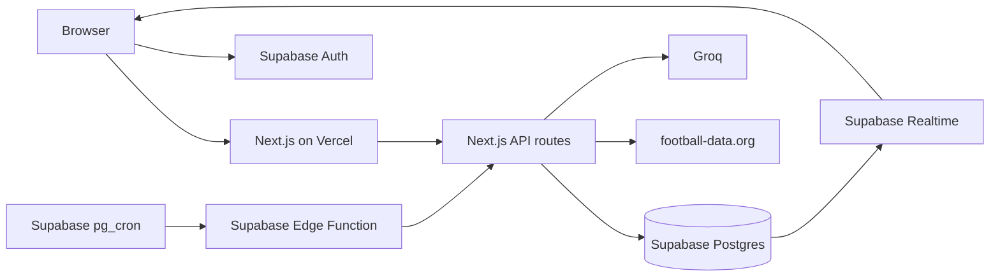
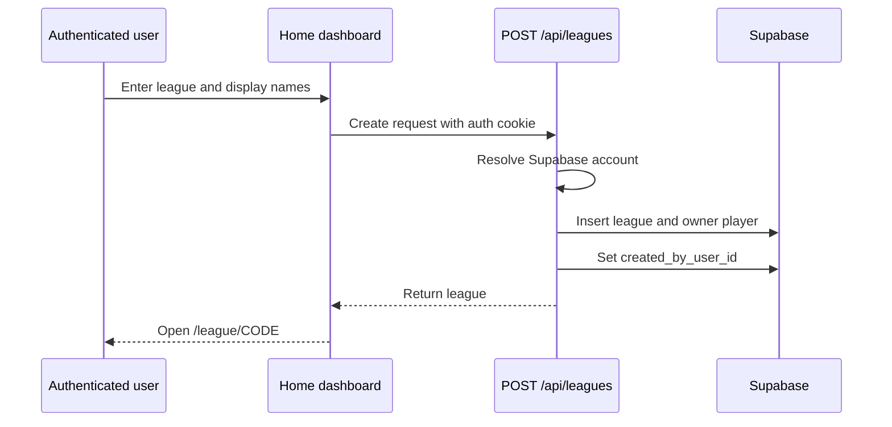
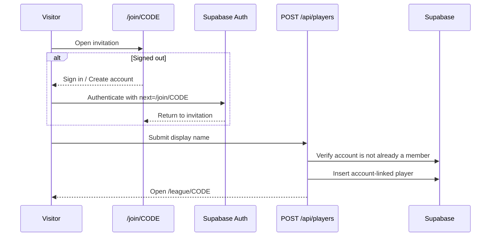
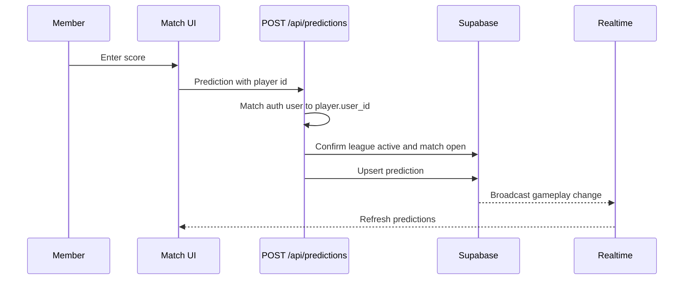
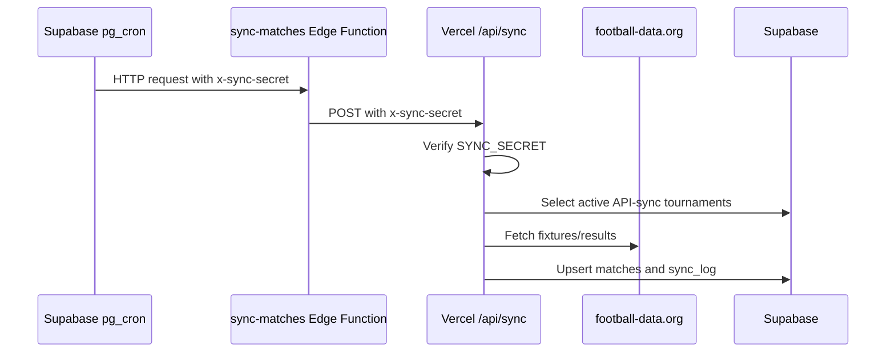

# Tournament Predictor: Workflow And Architecture

## Account-First Game Flow

1. A signed-out visitor sees only **Sign in** and **Create account** on `/`.
2. After authentication, the home dashboard shows create/join controls plus active and archived leagues linked to the account.
3. Opening `/join/CODE` while signed out shows an invite-aware auth gate. The safe internal destination is preserved through sign-in, signup, and email confirmation.
4. Opening `/league/CODE` while signed out redirects to `/auth/sign-in?next=/league/CODE`.
5. An authenticated member enters gameplay. An authenticated non-member sees the join prompt.

External and protocol-relative `next` values are rejected and fall back to `/`.

## High-Level Architecture

## Runtime Boundaries

### Browser

- Uses Supabase Auth for sign-in, signup, sign-out, and cookie-backed sessions.
- Receives safe server-rendered league/player data.
- Subscribes to `matches` and `match_predictions` Realtime changes.
- Never receives `players.session_token`.
- Never subscribes directly to `players` rows.

### Next.js Server

- Resolves the authenticated account from Supabase cookies.
- Uses the service-role client only after authentication or secret verification.
- Loads account memberships for the home dashboard.
- Loads league data and the current account's membership for league pages.
- Verifies every gameplay mutation against `players.user_id`.

### Supabase

- Auth owns account identity.
- RLS denies anonymous gameplay access.
- Authenticated users have read-only gameplay access.
- Direct gameplay writes are removed; API routes perform writes with the service role.
- `session_token` remains only as an unused compatibility column.

## Core Data Model

- `leagues`: configuration, invite code, owner account, archive state
- `players`: account-linked league membership and admin role
- `matches`: shared tournament fixtures and results
- `match_predictions`: per-player score picks
- `tournament_predictions`: winner and top-scorer picks
- `matchday_summaries`: AI matchday summaries
- `match_recaps`: per-match AI recaps
- `sync_log`: external sync diagnostics

## Create League

## Join League

Display-name-only recovery is intentionally unsupported. An existing unclaimed legacy name cannot be attached silently to an account.

## Submit A Prediction

Manual results also include `league_id`, allowing the API to verify that the authenticated player is an admin in the correct league.

## Scheduled Sync

The normal policy is daily synchronization plus a ten-minute match-window check. Archived-only tournaments are ignored.

## Security Model

- Supabase Auth cookies are the sole player identity.
- `getVerifiedPlayer` requires an authenticated account and matching `players.user_id`.
- Admin and owner operations cannot be authorized by legacy tokens.
- Owner archive/delete additionally requires `auth.uid() = leagues.created_by_user_id`.
- `SYNC_SECRET` is exclusively for automated sync/AI calls.
- Safe redirect handling accepts only paths beginning with one `/`; values such as `https://example.com` and `//example.com` fall back to `/`.
- The service-role key is server-only and bypasses RLS for verified API and server-rendering operations.

## Source Map

- `app/page.tsx`: server-authenticated home gate
- `components/home/HomeDashboard.tsx`: signed-in dashboard
- `app/join/[code]/page.tsx`: invite-aware auth gate
- `components/join/JoinLeagueForm.tsx`: account-backed join
- `app/league/[code]/page.tsx`: authenticated league loader
- `components/layout/LeagueHub.tsx`: gameplay and Realtime
- `lib/auth.ts`: API account/player verification
- `lib/auth-redirect.ts`: redirect sanitization
- `supabase/account_first_privacy_migration.sql`: existing-project privacy migration
- `supabase/functions/sync-matches/index.ts`: Supabase scheduler entry point
